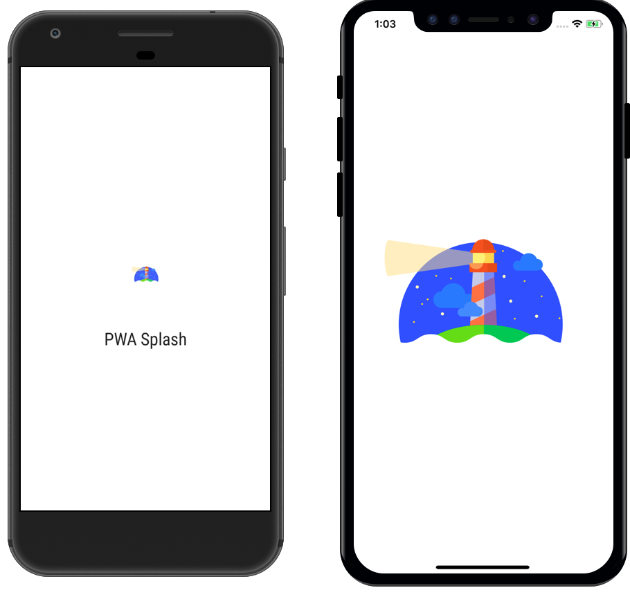

# PWA Splash Screens

Repository to support Medium blog post at [https://medium.com/@applification/progressive-web-app-splash-screens-80340b45d210](https://medium.com/@applification/progressive-web-app-splash-screens-80340b45d210)

## Live Version

If you simply want to test out the splash screens, visit [https://pwa-splash.now.sh](https://pwa-splash.now.sh) and add the app to your home screen when prompted on Android or manualy 'Add to Home Screen' on iOS.

## Running the App Locally

Install serve globally from npm.

`npm i -g serve`

Serve up the root directory:

`serve .`

Serve will serve the static HTML website on `http://localhost:5000`

### Manifest & Service Worker

In order to meet PWA requirements and show an App Install banner on Android this app has a functional App Manifest and Service Worker integrated.

## SketchFiles

Sketch files to generate the assets required for icons and splash screens can be found in the `assets` folder.

## Icons

Icons required to be a PWA created using: [https://realfavicongenerator.net/](https://realfavicongenerator.net/)
